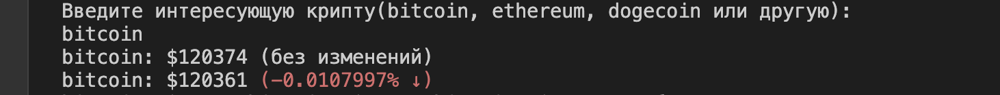
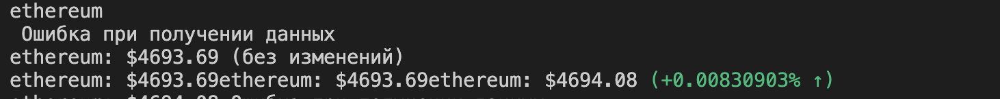

# Crypto Tracker (C++ + CoinGecko API)

Небольшое консольное приложение на C++, которое получает и отображает цену выбранной криптовалюты в режиме реального времени, используя API [CoinGecko](https://www.coingecko.com/).

## Содержание

* [Возможности](#Возможности)
* [Как получить API Key](#Как-получить-API-Key)
* [Структура проекта](#Структура-проекта)
* [Сборка и запуск](#Сборка-и-запуск)
* [Как пользоваться](#Как-пользоваться)
* [Визуальное представление работы](#Визуальное-представление-работы)
* [Возможные ошибки](#Возможные-ошибки)

## Возможности

* Получение актуальной цены криптовалюты (Bitcoin, Ethereum, Dogecoin и других).
* Отображение изменений цены в процентах с цветовой индикацией: зелёный ↑ — рост, красный ↓ — падение.
* Автообновление информации каждые 15 секунд.
* Поддержка MacOS, Linux и Windows.

## Как получить API Key

1. Перейдите на сайт [CoinGecko](https://www.coingecko.com/) и зарегистрируйтесь.
2. Создайте API Key, если требуется (для большинства публичных данных CoinGecko ключ не нужен).

## Структура проекта

```bash
Crypto_Tracker-CLI/  
├── lib/                  # Сторонние библиотеки  
│   ├── httplib.h         # HTTP-клиент   
│   └── nlohmann/         # JSON-парсер  
├── src/  
│   └── main.cpp          # код программы  
├── build/                # Папка для собранных файлов   
├── README.md             # Этот файл  
├── assets/               # Скриншоты и видео
```

## Сборка и запуск

### MacOS / Linux

```bash
mkdir build # в корневой директории
cd build
cmake ..
make
./crypto_tracker
```

### Windows (MinGW)

```bash
cd crypto_tracker
mkdir build
g++ src/main.cpp -o build/crypto_tracker.exe -Ilib -lssl -lcrypto -lpthread
build\crypto_tracker.exe
```

## Как пользоваться

1. Запустите программу:

   * Mac/Linux: `./build/crypto_tracker`
   * Windows: `build\crypto_tracker.exe`
2. Введите интересующую криптовалюту (например, `bitcoin`, `ethereum`, `dogecoin`).
3. Программа выведет актуальную цену в USD, а также процентное изменение с цветовой индикацией.
4. Данные обновляются каждые 5 секунд.

## Визуальное представление работы

**Скриншот работы приложения:**

  



**Видео с демонстрацией:**   

[Видео с демонстрацией](assets/3.mp4)  

## Возможные ошибки

* `Ошибка при получении данных` — сервер CoinGecko временно недоступен или неверно введено название криптовалюты.
* `[json.exception.type_error.302] type must be number, but is null` — API вернул пустые данные; убедитесь, что валюта существует.
* Сборка не проходит — убедитесь, что библиотеки `httplib.h` и `nlohmann/json.hpp` находятся в папке `lib`.
* Нет папки `build` — создайте её командой `mkdir build` в корне проекта.


